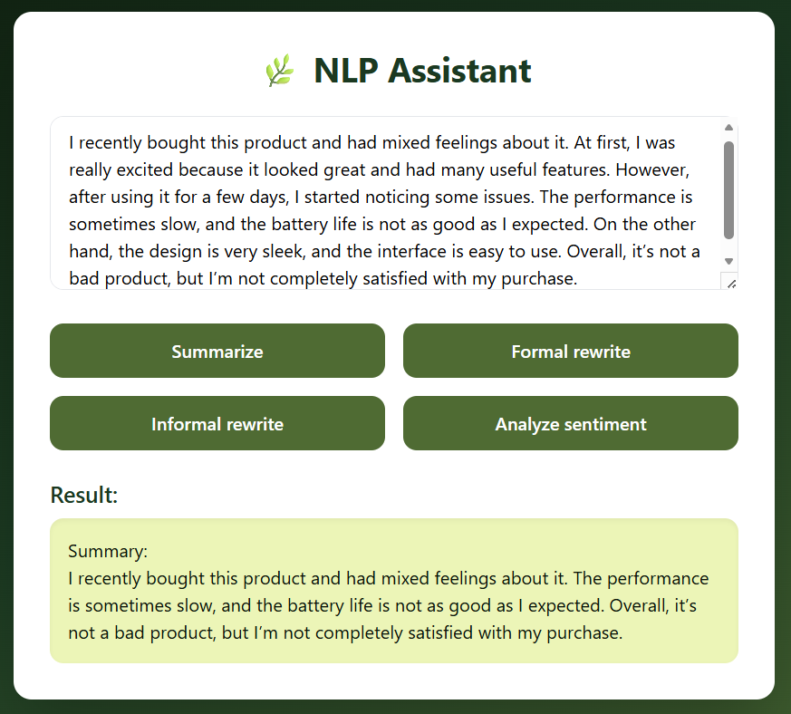
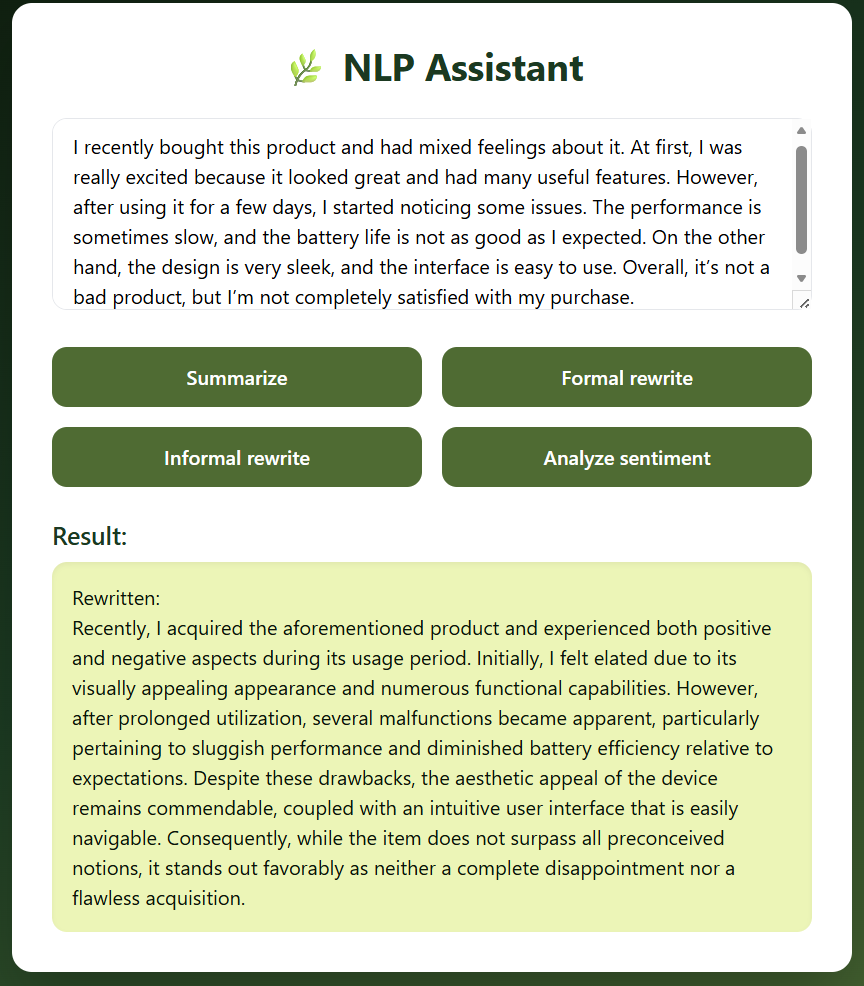
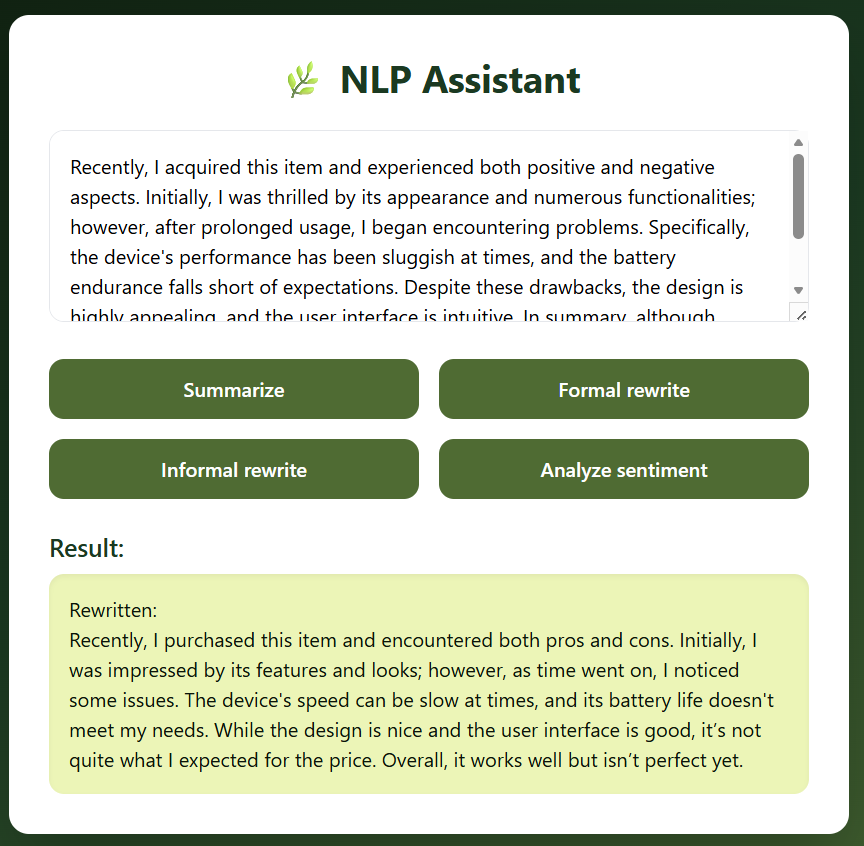
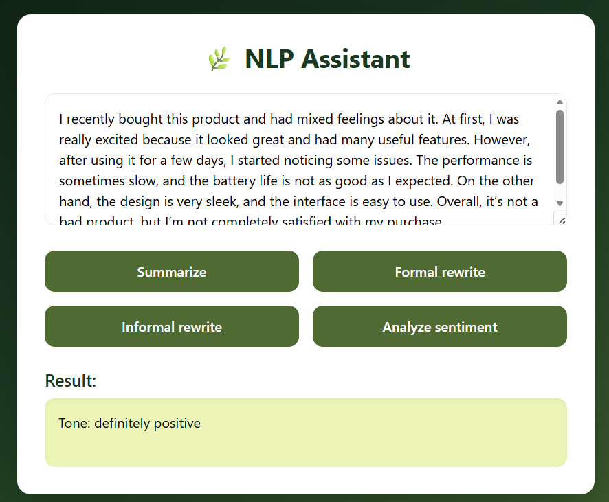

__NLP Assistant — веб-агент для обработки текста__
__Цель проекта__
Разработать NLP-агента, который:
- анализирует входной текст
- классифицирует его по тональности
- выполняет суммаризацию
- переписывает текст в заданном стиле


__Архитектура проекта__
```text
backend/
│
├── artifacts/                   # сохраненные артефакты модели
│   ├── embedding_matrix.npy     # матрица эмбеддингов
│   ├── sentiment_model.pth      # веса обученной модели
│   └── word2idx.pkl             # словарь (слово -> индекс)
│
├── data/                        # данные
│   └── sentiment_dataset.csv    # датасет для обучения
│
├── models/
│   ├── __init__.py              
│   ├── classifier.py            # обучение модели тональности
│   ├── glove.6B.200d.txt        # предобученные эмбеддинги GloVe
│   ├── inference.py             # инференс модели
│   └── sentiment_model.py       # архитектура BiLSTM модели
│
├── templates/
│   └── index.html               # пользовательский интерфейс
│
├── tools/
│   ├── __init__.py              
│   ├── rewrite.py               # переписывание текста (LLM)
│   ├── sentiment.py             # интерфейс классификации
│   └── summarization.py         # суммаризация (BART)
│
├── utils/
│   └── logger.py                # логирование
│
├── __init__.py                  
├── agent.py                     # логика агента
└── app.py                       # FastAPI сервер
```


__Используемые технологии__
__Backend__
- FastAPI
- PyTorch

__NLP__
- GloVe embeddings (200d)
- NLTK
- HuggingFace Transformers:
    - - facebook/bart-large-cnn (суммаризация)
    - - Qwen/Qwen2.5-1.5B-Instruct (переписывание текста)

__Frontend__
- HTML
- TailwindCSS


__Анализ тональности__
- является оберткой над кастомной моделью
- использует функцию predict_sentiment

__Суммаризация текста__
- загрузка через HuggingFace Transformers
- модель загружается лениво (при первом вызове)
- используется beam search для генерации

__Переписывание текста__
- используется модель Qwen/Qwen2.5-1.5B-Instruct
- применяется transformers.pipeline
- используется prompt-инжиниринг


__Запуск проекта__
1. Клонирование репозитория
git clone <repo_url>
cd project

2. Установка зависимостей
pip install -r requirements.txt

3. Обучение модели
python backend/models/classifier.py

После выполнения будут созданы артефакты:
word2idx.pkl
embedding_matrix.npy
sentiment_model.pth

4. Запуск сервера
uvicorn backend.app:app --reload --port 8080

5. Открытие приложения
http://127.0.0.1:8080


### Как работает агент (`agent.py`)

Агент реализован в файле `agent.py` и работает по следующему алгоритму:

1. Получает текст и инструкцию.
2. Определяет задачу.
3. Вызывает соответствующий инструмент.

#### Поддерживаемые инструкции

| Инструкция | Описание |
| :--- | :--- |
| `summary` | Суммаризация текста |
| `formal` | Переписывание в формальном стиле |
| `informal` | Переписывание в неформальном стиле |
| `tone` | Анализ тональности |


__Пример работы__






